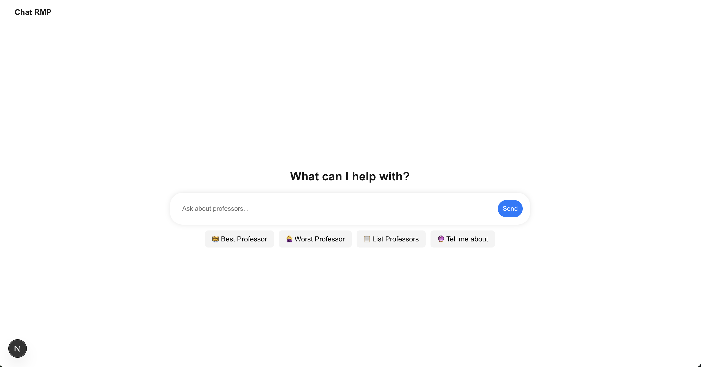

# 🧠 Chat RMP - Rate My Professor Chatbot

Chat RMP is an AI-powered chatbot that helps students discover the best (or worst!) professors in different departments at Queens college. Built with **FastAPI**, **OpenAI**, **Pinecone**, and a **Next.js frontend**, it lets users ask natural language questions like:

- "Who is the best math professor?"
- "List professors in the Computer Science department"
- "Tell me about Professor Erica Doran"

---

## 🚀 Features

- 🔎 **Natural Language Search** — Ask about any professor or department in plain English.
- 🤖 **AI-Powered Summaries** — Summarizes student reviews using OpenAI's GPT.
- 📊 **Ranked Recommendations** — Finds best or worst professors using Pinecone vector search.
- 🧠 **Smart Suggestions** — Autocomplete queries based on your input.
- 📦 Stores vectors and metadata in Pinecone for fast similarity search.
- 🔎 Supports professor name lookups, department listings, and best-rated professors.
- ⚡ Powered by FastAPI for a clean, modular API backend.

---
## Demo

## 🛠️ Tech Stack

| Layer        | Technology                        |
|--------------|------------------------------------|
| Backend      | [FastAPI](https://fastapi.tiangolo.com/) |
| AI/LLM       | [OpenAI GPT-3.5](https://platform.openai.com/docs/models/gpt-3-5) |
| Vector DB    | [Pinecone](https://www.pinecone.io/) |
| Frontend     | [Next.js (React)](https://nextjs.org/) |
| Web Scraping | Selenium                       |
| Deployment   | Local (Future: Vercel + Render)     |

---

